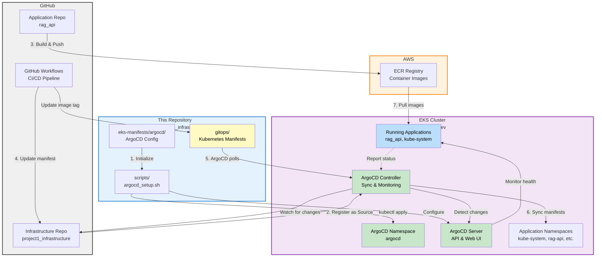

```mermaid
graph TB
    subgraph GitHub["GitHub"]
        appRepo["Application Repo<br/>rag_api"]
        infraRepo["Infrastructure Repo<br/>project1_infrastructure"]
        workflow["GitHub Workflows<br/>CI/CD Pipeline"]
    end
    
    subgraph ThisRepo["This Repository<br/>project1_infrastructure"]
        gitopsDir["gitops/<br/>Kubernetes Manifests"]
        eksManifests["eks-manifests/argocd/<br/>ArgoCD Config"]
        argocdSetup["scripts/<br/>argocd_setup.sh"]
    end
    
    subgraph AWS["AWS"]
        ecr["ECR Registry<br/>Container Images"]
    end
    
    subgraph Cluster["EKS Cluster<br/>project1-dev"]
        argocdNs["ArgoCD Namespace<br/>argocd"]
        argocdSvr["ArgoCD Server<br/>API & Web UI"]
        argocdCtrl["ArgoCD Controller<br/>Sync & Monitoring"]
        
        appNs["Application Namespaces<br/>kube-system, rag-api, etc."]
        apps["Running Applications<br/>rag_api, kube-system"]
    end
    
    %% Setup flow
    eksManifests -->|1. Initialize| argocdSetup
    argocdSetup -->|kubectl apply| argocdNs
    argocdSetup -->|Configure| argocdSvr
    
    %% Repository connection
    infraRepo -->|2. Register as Source| argocdCtrl
    argocdCtrl -->|Watch for changes| infraRepo
    
    %% CI/CD flow
    appRepo -->|3. Build & Push| ecr
    workflow -->|4. Update manifest| infraRepo
    workflow -->|Update image tag| gitopsDir
    
    %% Sync flow
    gitopsDir -->|5. ArgoCD polls| argocdCtrl
    argocdCtrl -->|Detect changes| argocdSvr
    argocdCtrl -->|6. Sync manifests| appNs
    ecr -->|7. Pull images| apps
    
    %% Monitoring
    argocdSvr -->|Monitor health| apps
    apps -.->|Report status| argocdCtrl
    
    style GitHub fill:#f0f0f0,stroke:#333,stroke-width:2px
    style ThisRepo fill:#e3f2fd,stroke:#1976d2,stroke-width:2px
    style AWS fill:#fff3e0,stroke:#f57c00,stroke-width:2px
    style Cluster fill:#f3e5f5,stroke:#7b1fa2,stroke-width:2px
    
    style argocdNs fill:#c8e6c9,color:#000
    style argocdSvr fill:#c8e6c9,color:#000
    style argocdCtrl fill:#c8e6c9,color:#000
    style apps fill:#bbdefb,color:#000
    style gitopsDir fill:#fff9c4,color:#000
```
