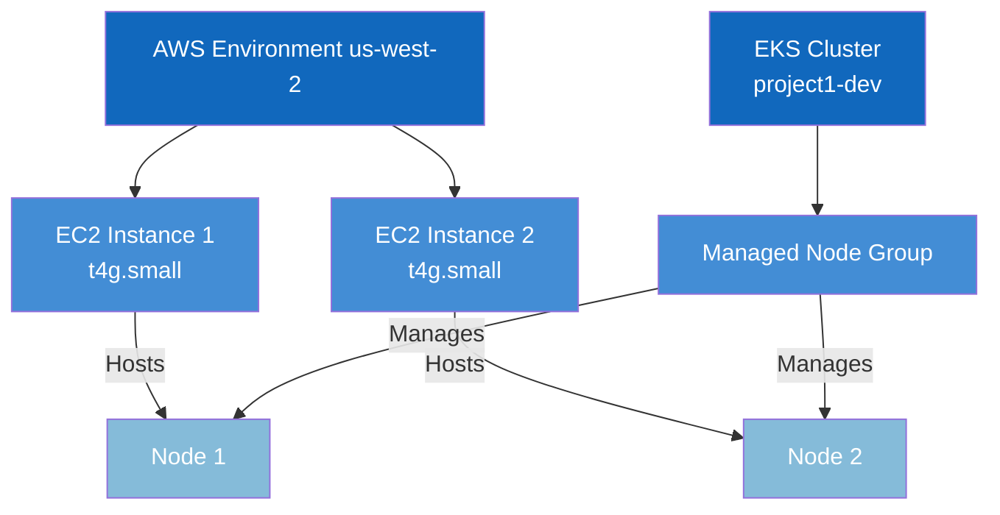

```mermaid
graph TB
    aws["AWS Environment us-west-2"]
    
    ec2_1["EC2 Instance 1<br/>t4g.small"]
    ec2_2["EC2 Instance 2<br/>t4g.small"]
    
    eks["EKS Cluster<br/>project1-dev"]
    nodeGroup["Managed Node Group"]
    
    node1["Node 1"]
    node2["Node 2"]
    
    aws --> ec2_1
    aws --> ec2_2
    
    ec2_1 -->|Hosts| node1
    ec2_2 -->|Hosts| node2
    
    eks --> nodeGroup
    nodeGroup -->|Manages| node1
    nodeGroup -->|Manages| node2
    
    style aws fill:#1168bd,color:#fff
    style ec2_1 fill:#438dd5,color:#fff
    style ec2_2 fill:#438dd5,color:#fff
    style eks fill:#1168bd,color:#fff
    style nodeGroup fill:#438dd5,color:#fff
    style node1 fill:#85bbd9,color:#fff
    style node2 fill:#85bbd9,color:#fff
```