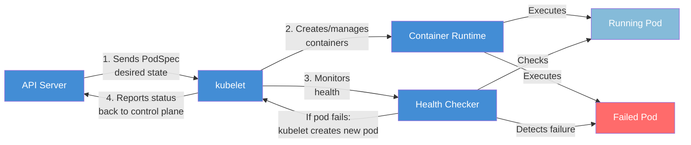

```mermaid
graph LR
    apiServer["API Server"]
    kubelet["kubelet"]
    runtime["Container Runtime"]
    healthCheck["Health Checker"]
    
    pod1["Running Pod"]
    pod2["Failed Pod"]
    
    apiServer -->|1. Sends PodSpec<br/>desired state| kubelet
    kubelet -->|2. Creates/manages<br/>containers| runtime
    runtime -->|Executes| pod1
    runtime -->|Executes| pod2
    
    kubelet -->|3. Monitors<br/>health| healthCheck
    healthCheck -->|Checks| pod1
    healthCheck -->|Detects failure| pod2
    
    healthCheck -->|If pod fails:<br/>kubelet creates new pod| kubelet
    
    kubelet -->|4. Reports status<br/>back to control plane| apiServer
    
    style apiServer fill:#438dd5,color:#fff
    style kubelet fill:#438dd5,color:#fff
    style runtime fill:#438dd5,color:#fff
    style healthCheck fill:#438dd5,color:#fff
    style pod1 fill:#85bbd9,color:#fff
    style pod2 fill:#ff6b6b,color:#fff
```