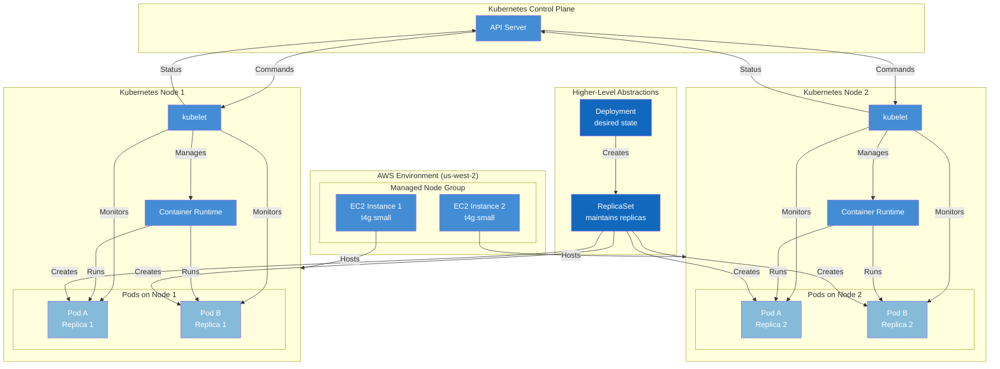

```mermaid
graph TB
    subgraph AWS["AWS Environment (us-west-2)"]
        subgraph nodeGroup["Managed Node Group"]
            ec2_1["EC2 Instance 1<br/>t4g.small"]
            ec2_2["EC2 Instance 2<br/>t4g.small"]
        end
    end
    
    subgraph controlPlane["Kubernetes Control Plane"]
        apiServer["API Server"]
    end
    
    subgraph node1["Kubernetes Node 1"]
        kubelet1["kubelet"]
        runtime1["Container Runtime"]
        subgraph pods1["Pods on Node 1"]
            pod1A["Pod A<br/>Replica 1"]
            pod1B["Pod B<br/>Replica 1"]
        end
    end
    
    subgraph node2["Kubernetes Node 2"]
        kubelet2["kubelet"]
        runtime2["Container Runtime"]
        subgraph pods2["Pods on Node 2"]
            pod2A["Pod A<br/>Replica 2"]
            pod2B["Pod B<br/>Replica 2"]
        end
    end
    
    subgraph abstractions["Higher-Level Abstractions"]
        deployment["Deployment<br/>desired state"]
        replicaSet["ReplicaSet<br/>maintains replicas"]
    end
    
    ec2_1 -->|Hosts| node1
    ec2_2 -->|Hosts| node2
    
    kubelet1 -->|Manages| runtime1
    kubelet1 -->|Monitors| pod1A
    kubelet1 -->|Monitors| pod1B
    runtime1 -->|Runs| pod1A
    runtime1 -->|Runs| pod1B
    
    kubelet2 -->|Manages| runtime2
    kubelet2 -->|Monitors| pod2A
    kubelet2 -->|Monitors| pod2B
    runtime2 -->|Runs| pod2A
    runtime2 -->|Runs| pod2B
    
    apiServer -->|Commands| kubelet1
    apiServer -->|Commands| kubelet2
    kubelet1 -->|Status| apiServer
    kubelet2 -->|Status| apiServer
    
    deployment -->|Creates| replicaSet
    replicaSet -->|Creates| pod1A
    replicaSet -->|Creates| pod1B
    replicaSet -->|Creates| pod2A
    replicaSet -->|Creates| pod2B
    
    style apiServer fill:#438dd5,color:#fff
    style kubelet1 fill:#438dd5,color:#fff
    style kubelet2 fill:#438dd5,color:#fff
    style runtime1 fill:#438dd5,color:#fff
    style runtime2 fill:#438dd5,color:#fff
    style ec2_1 fill:#438dd5,color:#fff
    style ec2_2 fill:#438dd5,color:#fff
    style pod1A fill:#85bbd9,color:#fff
    style pod1B fill:#85bbd9,color:#fff
    style pod2A fill:#85bbd9,color:#fff
    style pod2B fill:#85bbd9,color:#fff
    style deployment fill:#1168bd,color:#fff
    style replicaSet fill:#1168bd,color:#fff
```
