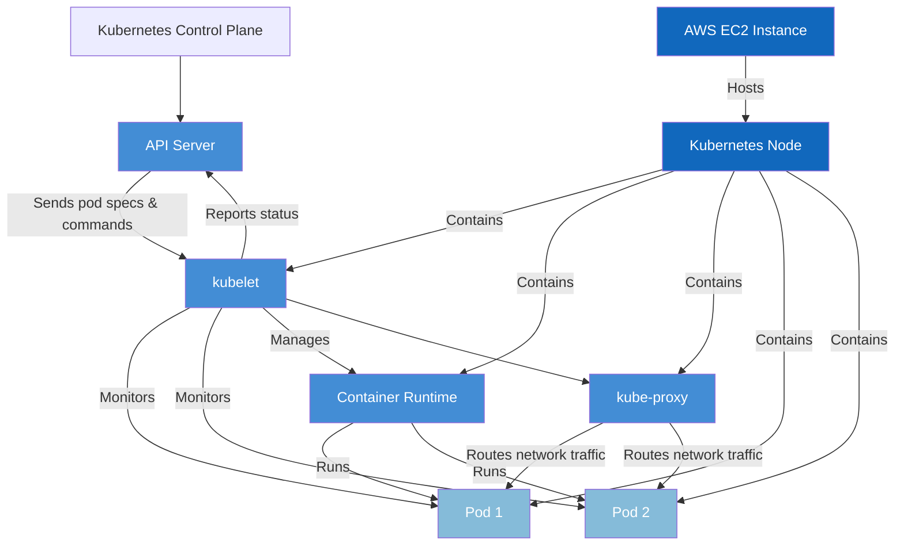

```mermaid
graph TB
    controlPlane["Kubernetes Control Plane"]
    apiServer["API Server"]
    
    node["Kubernetes Node"]
    kubelet["kubelet"]
    runtime["Container Runtime"]
    kubeProxy["kube-proxy"]
    
    pod1["Pod 1"]
    pod2["Pod 2"]
    
    ec2["AWS EC2 Instance"]
    
    controlPlane --> apiServer
    apiServer -->|Sends pod specs & commands| kubelet
    kubelet -->|Monitors| pod1
    kubelet -->|Monitors| pod2
    kubelet -->|Manages| runtime
    runtime -->|Runs| pod1
    runtime -->|Runs| pod2
    kubeProxy -->|Routes network traffic| pod1
    kubeProxy -->|Routes network traffic| pod2
    
    kubelet --> kubeProxy
    
    ec2 -->|Hosts| node
    node -->|Contains| kubelet
    node -->|Contains| runtime
    node -->|Contains| kubeProxy
    node -->|Contains| pod1
    node -->|Contains| pod2
    
    kubelet -->|Reports status| apiServer
    
    style apiServer fill:#438dd5,color:#fff
    style kubelet fill:#438dd5,color:#fff
    style runtime fill:#438dd5,color:#fff
    style kubeProxy fill:#438dd5,color:#fff
    style pod1 fill:#85bbd9,color:#fff
    style pod2 fill:#85bbd9,color:#fff
    style node fill:#1168bd,color:#fff
    style ec2 fill:#1168bd,color:#fff
```