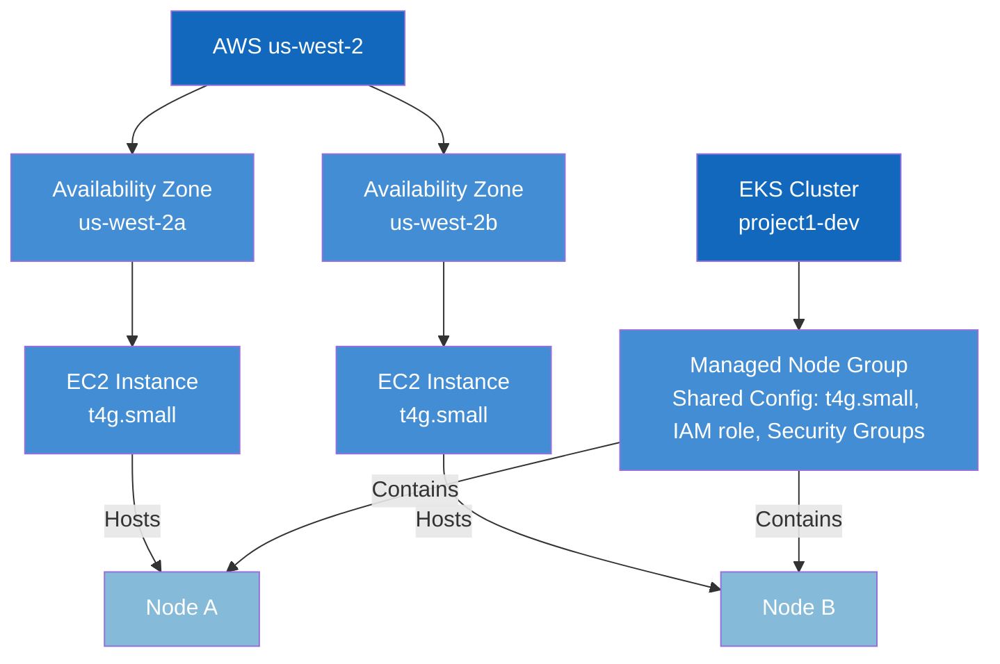

```mermaid
graph TB
    aws["AWS us-west-2"]
    
    az_a["Availability Zone<br/>us-west-2a"]
    az_b["Availability Zone<br/>us-west-2b"]
    
    ec2_a["EC2 Instance<br/>t4g.small"]
    ec2_b["EC2 Instance<br/>t4g.small"]
    
    eks["EKS Cluster<br/>project1-dev"]
    nodeGroup["Managed Node Group<br/>Shared Config: t4g.small, IAM role, Security Groups"]
    
    node_a["Node A"]
    node_b["Node B"]
    
    aws --> az_a
    aws --> az_b
    
    az_a --> ec2_a
    az_b --> ec2_b
    
    ec2_a -->|Hosts| node_a
    ec2_b -->|Hosts| node_b
    
    eks --> nodeGroup
    nodeGroup -->|Contains| node_a
    nodeGroup -->|Contains| node_b
    
    style aws fill:#1168bd,color:#fff
    style az_a fill:#438dd5,color:#fff
    style az_b fill:#438dd5,color:#fff
    style ec2_a fill:#438dd5,color:#fff
    style ec2_b fill:#438dd5,color:#fff
    style eks fill:#1168bd,color:#fff
    style nodeGroup fill:#438dd5,color:#fff
    style node_a fill:#85bbd9,color:#fff
    style node_b fill:#85bbd9,color:#fff
```
