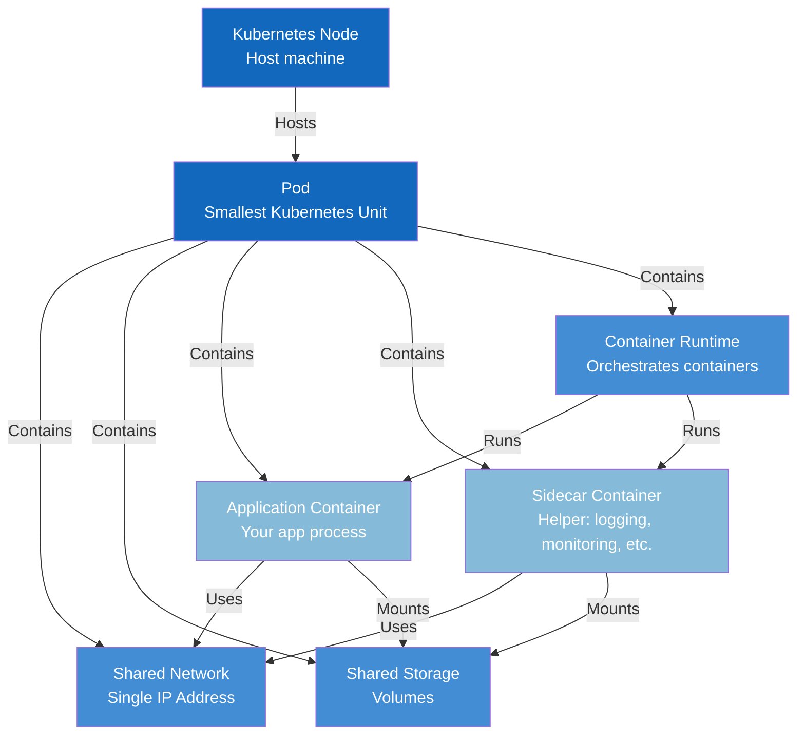

```mermaid
graph TB
    pod["Pod<br/>Smallest Kubernetes Unit"]
    
    network["Shared Network<br/>Single IP Address"]
    storage["Shared Storage<br/>Volumes"]
    
    appContainer["Application Container<br/>Your app process"]
    sidecar["Sidecar Container<br/>Helper: logging, monitoring, etc."]
    
    runtime["Container Runtime<br/>Orchestrates containers"]
    
    node["Kubernetes Node<br/>Host machine"]
    
    appContainer -->|Uses| network
    sidecar -->|Uses| network
    appContainer -->|Mounts| storage
    sidecar -->|Mounts| storage
    
    runtime -->|Runs| appContainer
    runtime -->|Runs| sidecar
    
    pod -->|Contains| network
    pod -->|Contains| storage
    pod -->|Contains| appContainer
    pod -->|Contains| sidecar
    pod -->|Contains| runtime
    
    node -->|Hosts| pod
    
    style pod fill:#1168bd,color:#fff
    style network fill:#438dd5,color:#fff
    style storage fill:#438dd5,color:#fff
    style appContainer fill:#85bbd9,color:#fff
    style sidecar fill:#85bbd9,color:#fff
    style runtime fill:#438dd5,color:#fff
    style node fill:#1168bd,color:#fff
```