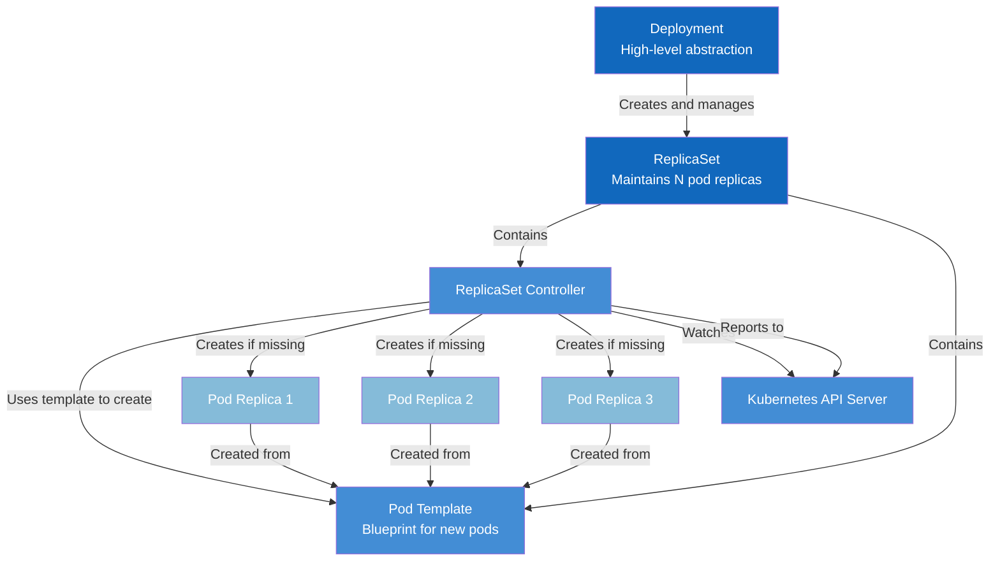

```mermaid
graph TB
    apiServer["Kubernetes API Server"]
    
    deployment["Deployment<br/>High-level abstraction"]
    
    replicaSet["ReplicaSet<br/>Maintains N pod replicas"]
    controller["ReplicaSet Controller"]
    podTemplate["Pod Template<br/>Blueprint for new pods"]
    
    pod1["Pod Replica 1"]
    pod2["Pod Replica 2"]
    pod3["Pod Replica 3"]
    
    deployment -->|Creates and manages| replicaSet
    replicaSet -->|Contains| controller
    replicaSet -->|Contains| podTemplate
    
    controller -->|Uses template to create| podTemplate
    controller -->|Creates if missing| pod1
    controller -->|Creates if missing| pod2
    controller -->|Creates if missing| pod3
    
    controller -->|Watches| apiServer
    controller -->|Reports to| apiServer
    
    pod1 -->|Created from| podTemplate
    pod2 -->|Created from| podTemplate
    pod3 -->|Created from| podTemplate
    
    style apiServer fill:#438dd5,color:#fff
    style deployment fill:#1168bd,color:#fff
    style replicaSet fill:#1168bd,color:#fff
    style controller fill:#438dd5,color:#fff
    style podTemplate fill:#438dd5,color:#fff
    style pod1 fill:#85bbd9,color:#fff
    style pod2 fill:#85bbd9,color:#fff
    style pod3 fill:#85bbd9,color:#fff
```